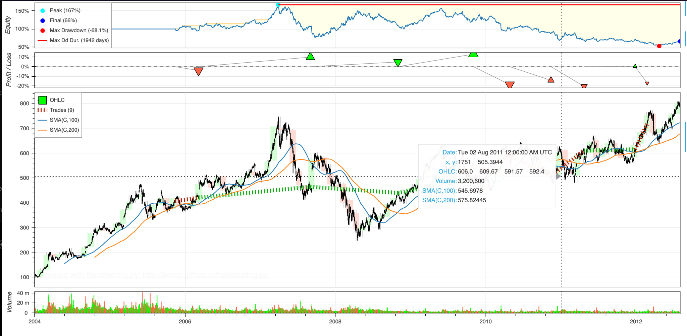

# Simple SMA Crossover Backtest — `backtesting.py`

This small project is me experimenting with the [`backtesting.py`](https://kernc.github.io/backtesting.py/) library for the first time.  
I’m testing a very basic **moving-average crossover** strategy on Google’s historical stock data (built into the library) to understand how the framework works and how to read its outputs.

---

## What this is

- A learning exercise, not a profitable strategy.
- A simple test of the workflow:  
  **define a strategy → run a backtest → inspect results & chart**.
- Helps me get familiar with:
  - Defining indicators (`SMA(100)`, `SMA(200)`)
  - Generating buy/sell signals from crossovers
  - Running a backtest with trading costs
  - Reading the visual and statistical output

---

## Output

*(Insert image here)*

---

## How to read the output

1. **Equity Curve (top strip)**  
   - Blue line = portfolio growth over time.  
   - Dots mark **peak return**, **final return**, and **max drawdown** (size and duration).  
   - Max drawdown duration shows how long it took to recover from the worst loss.

2. **Price Chart with Indicators (middle)**  
   - Black candles = GOOG price.  
   - Blue line = SMA(100), Orange line = SMA(200).  
   - Buy markers appear when the fast SMA crosses above the slow SMA (golden cross).  
   - Sell markers appear when the fast SMA crosses below the slow SMA (death cross).  
   - Green/red shaded areas show when the strategy is in a position.

3. **Profit/Loss Markers (just above the price chart)**  
   - Small green/red triangles indicate notable gains or losses from trades.

4. **Volume (bottom strip)**  
   - Green/red bars for daily traded volume, giving context to price moves.

---

## What the stats tell you

When `backtest.run()` is called, it returns metrics like:

- Total return (%) and annualized growth (CAGR)  
- Max drawdown (%) and how long it lasted  
- Number of trades, win rate, best/worst trade  
- Sharpe ratio, volatility, exposure time  

---

## Why I’m doing this

- To learn **how** a backtesting framework operates.  
- To connect **signals → trades → results** visually and statistically.  
- To practice interpreting equity curves, drawdowns, and trade distributions.  
- To see how transaction costs change outcomes.

---

## Key takeaways

- The chart makes it easy to see **trend-following behavior**, **whipsaws**, and **drawdowns**.  
- The goal here is exploration, not optimization.

---
